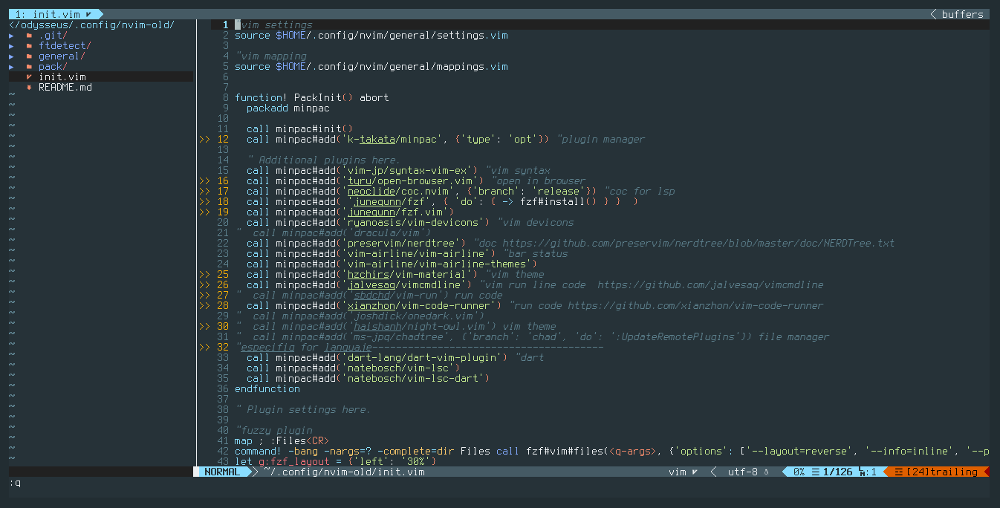

# My simple config for use neovim as IDE

This config file only contains the minimal(but totally functional) plugins for
use nvim as IDE

the list of plugins are:

1. [minipac](https://github.com/k-takata/minpac) plugin manager
2. [syntax-vim-ex](https://github.com/vim-jp/syntax-vim-ex) syntax plugin
3. [open-browser](https://github.com/tyru/open-browser.vim) 
4. [coc](https://github.com/neoclide/coc.nvim) for LSP
5. [fzf](https://github.com/junegunn/fzf) for searching files
6. [vim-devicons](https://github.com/ryanoasis/vim-devicons)
7. [nerdtree](https://github.com/preservim/nerdtree) for file management
8. [vim-airline](https://github.com/vim-airline/vim-airline) for bar status info
9. [vim-material](https://github.com/hzchirs/vim-material) for theming
10. [vimcmdline](https://github.com/jalvesaq/vimcmdline) for run selected line
11. [vim-code-runner](https://github.com/xianzhon/vim-code-runner) for run code

# Aditional dependencies for plugins
1. Nodejs
2. npm
3. fzf
4. [nerd-fonts](https://github.com/ryanoasis/nerd-fonts)

if you have problems please refer to git plugin repo for more info

# Installation

1. in terminal run:

   `wget -O - https://raw.githubusercontent.com/joselbr2099/NeoIDE/main/install | bash`

2. open nvim and install plugins(ignore errors):

   `:PackUpdate`
   
3. restart nvim and fun!!!   

# Keybindings

key config are in: `nvim/general/mappings.vim`

# Settings

settings for neovim are in: `nvim/general/settings.vim`
for plugins in: `nvim/init.vim`
